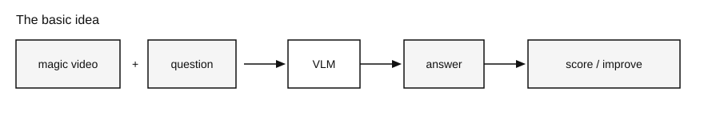
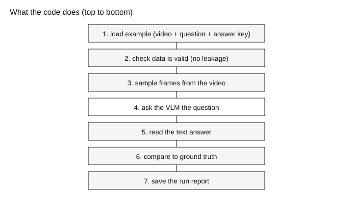
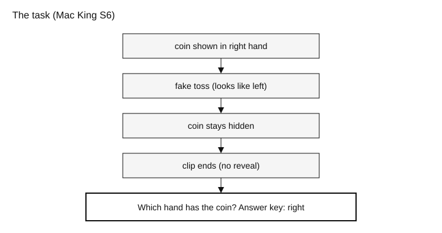
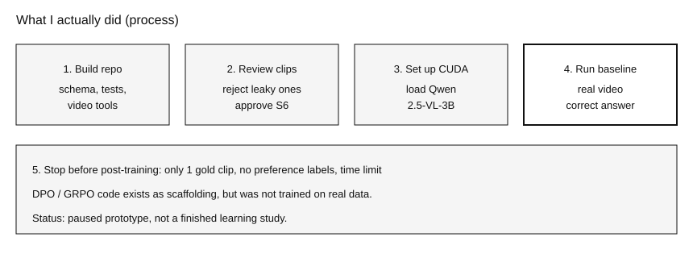
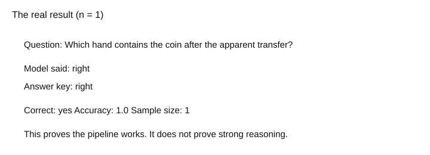
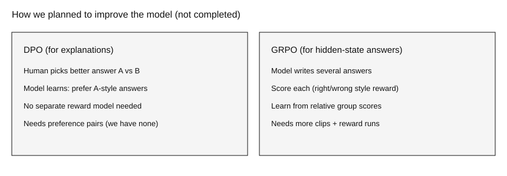
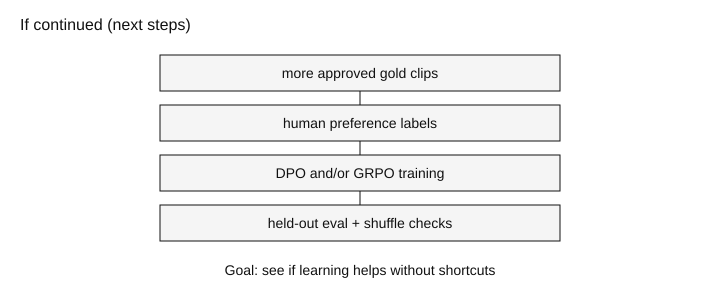

# Professor Walkthrough

**Open this file and scroll.** Each section has a simple diagram you can point at while talking.

**Status:** paused research prototype. Real zero-shot pipeline works on **1** example. Post-training was **not** finished.

---

## 1. What this project is about

I wanted to test whether we can teach an open vision-language model (VLM) to reason about **hidden states** in short magic videos - for example, which hand still has a coin after a fake transfer - and later improve that with preference / reward training (DPO / GRPO), without the model just cheating on shortcuts.

**Say this:**

> "Video plus a question go into a VLM. It answers. We can score the answer. Later we hoped to train on those scores. We only finished the first real end-to-end test."

---

## 2. What a VLM is (plain English)

- A normal language model reads text and writes text.
- A vision model looks at images.
- A **VLM** does both: it looks at frames from a video **and** reads a question, then writes an answer.

In this project the model is **Qwen2.5-VL-3B-Instruct** (small enough for an RTX 3060).

It does **not** move a robot or perform magic. It only watches clips and answers questions.

---

## 3. How the software is wired

Think of a conveyor belt. Every experiment is supposed to go through the same steps so results stay honest.

| Step | What it means in practice |
|------|---------------------------|
| Example | A JSON line with video path, question, and answer key |
| Validation | Catch bad data and train/test leakage |
| Frames | Pull a few frames from the MP4 (not the whole file at once) |
| VLM | Generate a text answer |
| Compare | Exact match to the answer key |
| Report | Save what happened under `runs/` / `reports/` |

Training methods (DPO / GRPO) were meant to **plug into** this belt later. They are not a separate mystery project.

---

## 4. The concrete task

Magic is useful because the true state can be **hidden**. A last frame alone can mislead you.

We used Mac King supplementary clip **S6** (Cui et al. 2011): fake toss, **no final reveal**.

**Question:** Which hand contains the coin after the apparent transfer?  
**Answer key:** `right`

Earlier Wikimedia cups-and-balls clips were **rejected as gold** (transparent cups / visible answers). Keeping them out was intentional scientific rigor, not a failure.

---

## 5. What I did (my process)

### In more detail

1. **Built the research repo** - dataset schema, validation, leakage checks, video frame sampling, inference, evaluation, tests, project-health audits, plus scaffolds for preferences / DPO / GRPO.
2. **Reviewed real footage** - inspected Wikimedia pilots (controls only) and Mac King Movie1-7. Human-approved **S6** as the first gold hidden-state example. Left **S7** pending.
3. **Got CUDA + Qwen working** - RTX 3060, PyTorch with CUDA, loaded Qwen2.5-VL-3B from Hugging Face cache.
4. **Ran a real zero-shot baseline** - config `configs/baseline_qwen25vl_3b.yaml`, run `baseline-real-v1`, evidence in `reports/real_zero_shot_baseline/`.
5. **Paused** - only 1 approved gold clip; no preference dataset; not enough time for an honest post-training study.

---

## 6. What actually worked

| Item | Value |
|------|--------|
| Model | Qwen2.5-VL-3B-Instruct (untouched base) |
| Clip | Mac King S6 / `Movie6.MP4` |
| Model answer | `right` |
| Ground truth | `right` |
| n | **1** |
| Accuracy | **1.0** |

**Honest line to say:**

> "The full pipeline is real. One correct answer is not proof of general reasoning, temporal reasoning, or that training would help."

---

## 7. Easy versions of the learning ideas (planned, not done)

### Preference (simple)

Show a human two answers. They pick the better one. That pair teaches the model what "good" looks like.

### DPO (simple)

Uses those preferred / rejected pairs to update the model **directly**. No separate "score machine" required. Good fit for explanations. **We never collected real pairs, so we never ran real DPO.**

### Reward (simple)

A number that says "how good was this answer?" Example: 1 if the hand label matches, 0 if not. Useful, but the model can learn to game the number.

### GRPO (simple)

For one question, sample several answers, score them, and push the model toward the better ones **relative to that group**. Attractive for a right/wrong hidden-state reward. **We never ran real GRPO on the VLM.**

### PPO (simple)

A heavier RL method that usually needs extra models (including a critic). We deferred it because of complexity / memory.

---

## 8. What I would do next

1. Approve more gold clips (aim ~5, then larger).
2. Collect human preference pairs for explanations.
3. Run DPO and/or GRPO, then evaluate on held-out clips (and optional frame-order shuffle) to check for shortcuts.

---

## 9. Short scripts you can say

### 30 seconds

> I'm building a VLM prototype for hidden-state questions in magic videos. I got a real Qwen2.5-VL pipeline working on one approved Mac King clip - it answered "right" correctly. I stopped before DPO/GRPO because I only had one gold example and no preference data.

### If asked "does n=1 prove reasoning?"

> No. It proves the pipeline and one zero-shot prediction. Not generalization.

### If asked "why magic?"

> The true object state can be hidden, and misdirection makes last-frame shortcuts fail. That stresses visual + temporal inference.

### If asked "why pause?"

> Time and data. Software spine works; the learning study needs more labeled clips.

---

## 10. Where to point in the repo

| Thing | Path |
|-------|------|
| This walkthrough | `docs/WALKTHROUGH.md` |
| Live status | `PROJECT_STATUS.md` |
| Gold example | `data/examples/hidden_state_pilot.jsonl` |
| Formal result | `reports/real_zero_shot_baseline/` |
| Baseline config | `configs/baseline_qwen25vl_3b.yaml` |
| Code package | `src/magic_vlm/` |

Open this file in GitHub or Cursor preview so the diagrams render, then scroll section by section while you talk.
